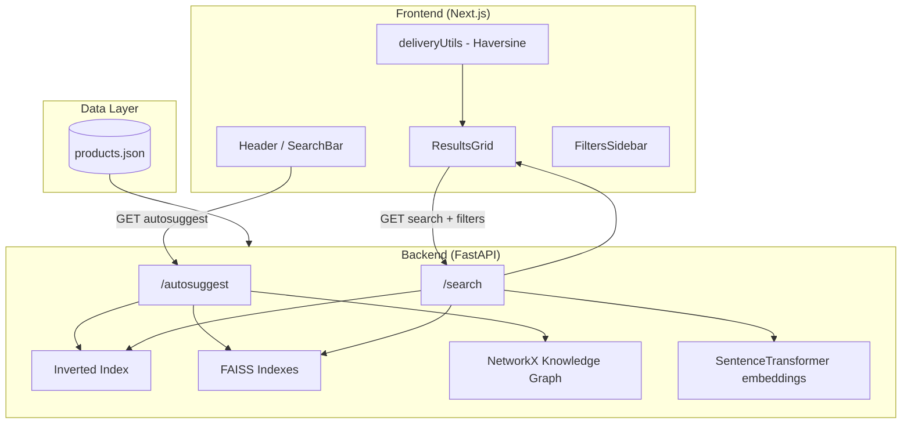

# Flipkart Grid Search System

A full-stack e-commerce search experience inspired by Flipkart Grid. It combines **intelligent autosuggest**, **hybrid semantic + lexical search**, **faceted filtering**, and a **Flipkart-style UI** over a real product catalog (~15K products from Kaggle).

Built for **Flipkart Grid 7.0**–style problem statements: search relevance, typo tolerance, query understanding, and production-like UX.

---

## Table of Contents

- [Features Implemented](#features-implemented)
- [System Architecture](#system-architecture)
- [Project Structure](#project-structure)
- [Tech Stack](#tech-stack)
- [Setup & Run](#setup--run)
- [API Overview](#api-overview)
- [How Search Works (High Level)](#how-search-works-high-level)
- [Optional: SRP (Elasticsearch LTR)](#optional-srp-elasticsearch-ltr)
- [Interview Prep](#interview-prep)
- [Troubleshooting](#troubleshooting)
- [Credits](#credits)

---

## Features Implemented

### Search & Autosuggest (Backend)

| Feature | Description |
|--------|-------------|
| **Multi-strategy autosuggest** | Prefix trie, substring match, fuzzy (RapidFuzz), phonetic (Double Metaphone), semantic neighbors (FAISS), knowledge-graph expansion, and query templates |
| **Typo tolerance** | Fuzzy matching + phonetic codes when exact prefix match is weak |
| **Trending suggestions** | Global trending (empty query), per-letter trending (single character), and letter-prefix trending |
| **Query templates** | e.g. `shirt` → `shirt for men`, `shirt with cotton`; price templates like `laptop under 50000` |
| **Context-aware autosuggest** | Prioritizes suggestions in the same category hierarchy as recent searches (`context_category_path`) |
| **Hybrid product search** | FAISS semantic search (title + full composite text) **union** inverted-index lexical hits |
| **Relevance ranking** | Weighted score: semantic similarity, rating, `search_boost`, review volume |
| **Natural language price** | Parses `under 50000`, `below 30000` from query and applies filters |
| **Faceted search** | Returns brand/category facet counts for the filter UI |
| **Sponsored placement** | Picks a promoted product by `search_boost` without replacing the top organic result |
| **Related products** | Interleaves `related_ids` into result list for discovery |
| **Stemming** | Simple plural handling in inverted index (`phones` ↔ `phone`) |
| **Phrase extraction** | spaCy noun chunks build the autosuggest phrase catalog |

### Frontend (Next.js)

| Feature | Description |
|--------|-------------|
| **Flipkart-style UI** | Header, search bar, trending bar, welcome categories, product grid |
| **Live autosuggest** | Debounced calls to `/autosuggest`; keyboard navigation (↑/↓/Enter/Esc) |
| **Search results** | Grid with images, ratings, MRP vs offer price, Flipkart Assured badge |
| **Filters** | Price range, minimum rating, brand, category |
| **Sort** | Relevance, price (low/high), rating, newest |
| **Delivery estimates** | Haversine distance from user GPS → warehouse coordinates (1–7 days) |
| **Cart** | `localStorage` persistence with quantity |
| **Login modal** | Demo auth stored in `localStorage` |
| **Responsive layout** | Mobile filter drawer, sticky header |
| **Recent & context** | Recent searches + category path passed back for smarter suggest |

### Optional: SRP Module

| Feature | Description |
|--------|-------------|
| **Elasticsearch + LTR** | Learning-to-Rank rescoring with `featureset.json` and `model.json` |
| **Separate pipeline** | `SRP/` is an alternate/advanced ranking path (see [SRP/README.md](SRP/README.md)) |

---

## System Architecture

### High-level diagram



### Request flow: search

```
User types query → Frontend builds URL params (filters, sort)
                → GET /search?q=...&min_price=...&brand=...
                → Backend: normalize query → FAISS + inverted index → merge candidates
                → Apply filters → score & sort → facets + sponsored_id
                → Frontend: map JSON → compute delivery days → render cards
```

### Request flow: autosuggest

```
User types in SearchBar → GET /autosuggest?q=...
                       → Trie / fuzzy / phonetic / semantic / graph / templates
                       → Rank by product boost, rating, reviews
                       → Return up to 8 title-cased strings
```

### Design choices (for interviews)

- **Precomputed embeddings at startup**: Fast queries; trade-off is longer cold start and memory use.
- **Hybrid retrieval**: Semantic search catches synonyms (“earbuds” vs “airpods”); lexical index catches exact tokens.
- **Monolithic FastAPI app**: Simple to demo; production might split indexing from serving.
- **Client-side cart/auth**: Demo scope; real Flipkart would use backend sessions and payments.

---

## Project Structure

```
Flipkart_Grid_Project/
├── backend/
│   ├── main.py              # FastAPI: autosuggest + search + indexing at startup
│   ├── data/products.json   # Product catalog (primary DB for demo)
│   └── requirements.txt
├── frontend/
│   ├── app/page.tsx         # Main shell: query, filters, geolocation
│   ├── components/
│   │   ├── Header.tsx       # Search bar + autosuggest + cart/login
│   │   ├── ResultsGrid.tsx  # Calls /search, renders products
│   │   ├── FiltersSidebar.tsx
│   │   └── ...
│   └── lib/deliveryUtils.ts # Distance → delivery days
├── SRP/                     # Optional Elasticsearch LTR pipeline
│   ├── main.py
│   ├── seed_data.py
│   ├── featureset.json
│   └── model.json
├── convert_csv_to_json.py   # Kaggle CSV → products.json
├── interview.md             # How to describe project + Q&A for interviews
└── DOCUMENTATION.md         # Extended technical deep-dive
```

---

## Tech Stack

| Layer | Technologies |
|-------|----------------|
| **Backend** | Python, FastAPI, Uvicorn, Pydantic |
| **Search / ML** | sentence-transformers (`all-MiniLM-L6-v2`), FAISS, spaCy, RapidFuzz, Metaphone, pygtrie, NetworkX |
| **Frontend** | Next.js 15, React 18, TypeScript, Tailwind CSS, Radix UI |
| **Data** | JSON product store (~15K Flipkart-style products) |
| **Optional SRP** | Elasticsearch 9.0.1, LTR plugin |

---

## Setup & Run

### Prerequisites

- Python 3.8+
- Node.js 18+
- `backend/data/products.json` (included or generate via `convert_csv_to_json.py`)

### 1. Clone

```sh
git clone <repo-url>
cd Flipkart_Grid_Project
```

### 2. Backend

```sh
cd backend
python -m venv venv

# Windows
venv\Scripts\activate

# macOS / Linux
source venv/bin/activate

pip install -r requirements.txt
python -m spacy download en_core_web_sm
```

**First run note:** Startup loads products, builds FAISS indexes, and encodes embeddings. This can take 1–3 minutes depending on hardware.

```sh
uvicorn main:app --reload
```

API base: `http://localhost:8000`

### 3. Frontend

```sh
cd frontend
npm install
npm run dev
```

App: `http://localhost:3000`

### 4. Regenerate product data (optional)

```sh
# Place dataset.csv in project root, then:
python convert_csv_to_json.py
```

Output: `backend/data/products.json`

---

## API Overview

### `GET /autosuggest?q=&context_category_path=`

| `q` length | Behavior |
|------------|----------|
| Empty | Global trending keywords |
| 1 char | Per-letter trending (A–Z map) |
| 2+ chars | Full multi-strategy suggest pipeline |

Optional `context_category_path`: JSON array of category path from last search (frontend sends from `localStorage`).

### `GET /search`

| Parameter | Purpose |
|-----------|---------|
| `q` | Search query (required) |
| `min_price`, `max_price` | Price filter |
| `min_rating` | Minimum star rating |
| `brand`, `category` | Comma-separated filters |
| `sort` | `relevance` \| `price_low_high` \| `price_high_low` \| `rating` \| `newest` |

**Response shape:**

```json
{
  "total_hits": 120,
  "sponsored_id": 42,
  "most_relevant_category_path": ["Electronics", "Mobiles"],
  "results": [ { "id": 1, "title": "...", "price": 999, "warehouse_loc": { ... } } ],
  "facets": {
    "brands": [["Samsung", 12], ["Apple", 8]],
    "categories": [["Mobiles", 20]]
  }
}
```

Interactive docs: `http://localhost:8000/docs`

---

## How Search Works (High Level)

1. **Indexing (at startup):** Each product gets title + “full text” embeddings; tokens go into an inverted index; phrases go into a trie and knowledge graph.
2. **Retrieval:** Query is embedded; FAISS returns nearest products; inverted index adds keyword matches.
3. **Filtering:** Price, rating, brand, category; query may also set max price from “under X”.
4. **Ranking:**  
   `score = 0.4×semantic + 0.2×rating + 0.2×search_boost + 0.2×log(reviews)`
5. **Presentation:** Top results + sponsored slot + facets; frontend adds delivery ETA from GPS.

For algorithm details, see [DOCUMENTATION.md](DOCUMENTATION.md).

---

## Optional: SRP (Elasticsearch LTR)

The `SRP/` folder implements a **Learning-to-Rank** path on Elasticsearch (separate from the main FastAPI search).

1. Install Elasticsearch 9.0.1 + LTR plugin  
2. `python seed_data.py`  
3. Upload `featureset.json` and `model.json`  
4. Run `SRP/main.py` for LTR-rescored search  

See [SRP/README.md](SRP/README.md) for step-by-step setup.

---

## Interview Prep

Use **[interview.md](interview.md)** for:

- A **30–60 second “describe this project”** script  
- **Common interviewer questions** with talking points  
- **Technical deep-dive** answers (FAISS, hybrid search, autosuggest strategies)

Key source files include **inline comments** meant for walkthroughs: `backend/main.py`, `frontend/app/page.tsx`, `frontend/components/Header.tsx`, `frontend/components/ResultsGrid.tsx`, `frontend/lib/deliveryUtils.ts`.

---

## Troubleshooting

| Issue | Fix |
|-------|-----|
| Slow backend startup | Normal on first load (embeddings). Reduce products in JSON for dev. |
| `en_core_web_sm` missing | `python -m spacy download en_core_web_sm` |
| CORS / fetch errors | Ensure backend on `:8000`, frontend on `:3000` |
| No delivery days on cards | Allow browser location or use Bangalore fallback in `page.tsx` |
| Unicode errors | Use UTF-8 when reading/writing JSON |

---

## Credits

- Product data: [Kaggle Flipkart Product Dataset](https://www.kaggle.com/datasets/priyankkhanna/flipkart-product-dataset-by-priyank-khanna)
- Built with FastAPI, Next.js, FAISS, and sentence-transformers

---
